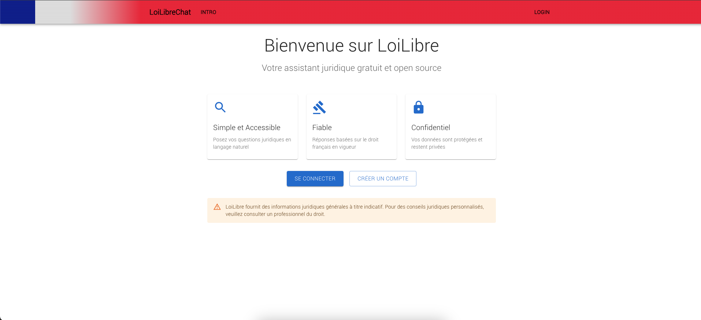
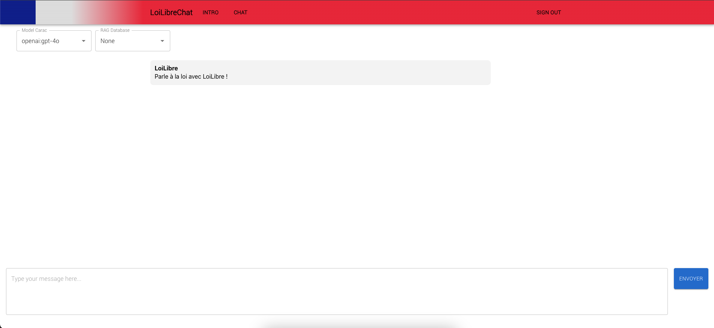

# LoiLibreChat
Front end ET backend de LoiLibre.
LoiLibre est une application qui permet d'intéragir avec la loi française via un modèle LLM (en langage naturel).

LoiLibre se veut open source et accessible à tous.

## LoiLibre lancement

LoiLibre se lance avec la commande suivante :

```bash
docker compose up
```

Cela lancera le serveur FastAPI et le front end React.

## LoiLibre utilisation

Via l'interface web, vous pouvez interragir avec le modèle LLM.



Ensuite, vous pouvez interragir avec le modèle LLM via un chat :



## LoiLibre développement

En cours de développement, il y a pour l'instant quelques élements à ajouter :

- [ ] Mettre en place un premier système RAG (Retrieval Augmented Generation)
Car pour l'instant, l'utilisateur est simplement en intéraction avec un modèle LLM public (mistral, openai, etc...)
Cela concerne le backend.

- [ ] Mettre en place un système de chat avec historique
Cela concerne le frontend ET le backend.

- [ ] Montrer des statistiques globales sur les questions posées
Cela concerne le backend ET le frontend.

